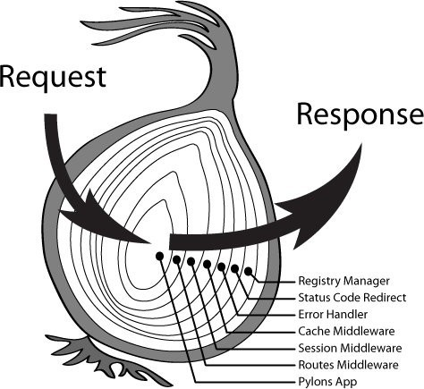
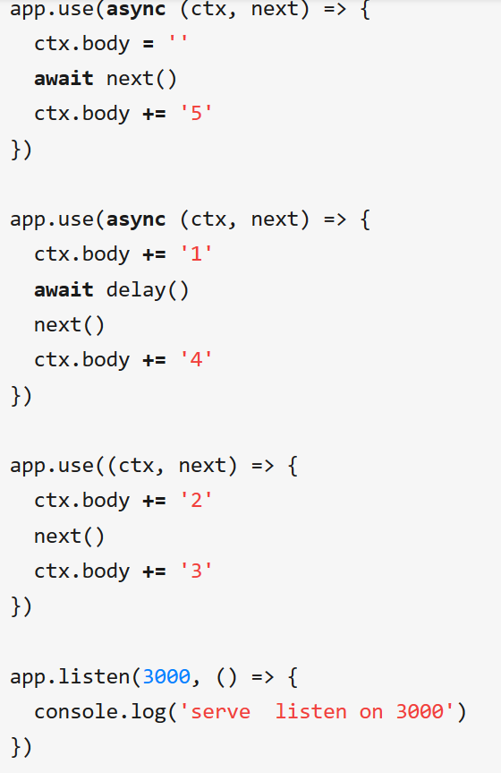
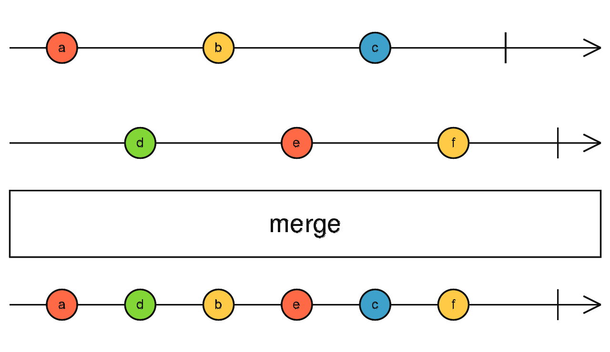
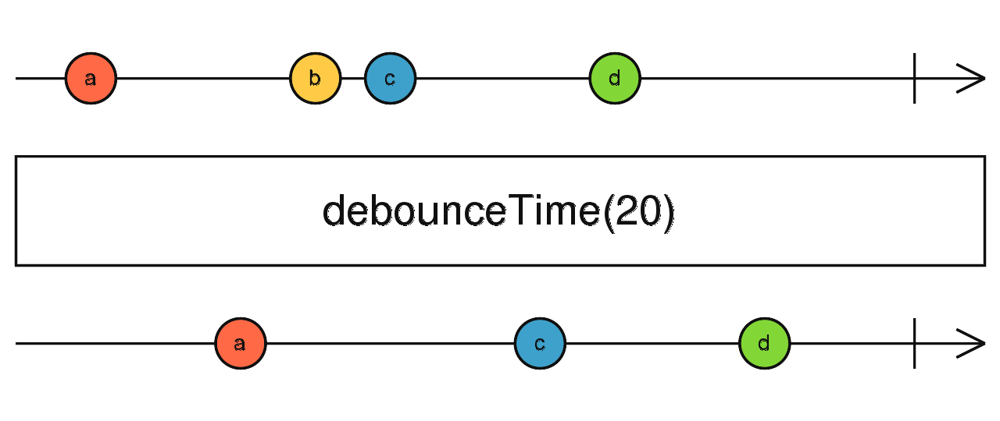
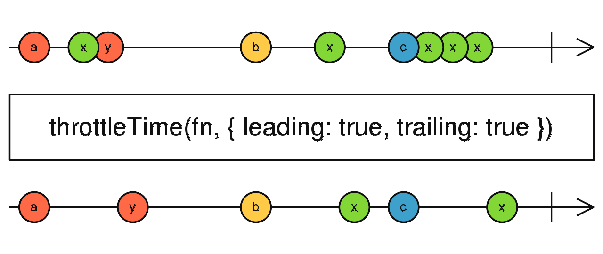

# full stack on js with vue + koa2

xsthunder/full-stack-on-js
https://github.com/xsthunder/full-stack-on-js

曾健骏

2020年5月13日

---

目的
--------

是：
1. js全栈技术点

2. 技术前瞻&带货

不是：

1. js教程

2. vue or koa2教程，[vue教程点击此处](./vue-starter-pack.md)

---

vue：数据绑定
-------

## 想法

逻辑代码和视图交互数据，统一存放在this.data

vue监听this.data变化，自动更新视图。

逻辑和视图分开，this.data是桥梁。

## 示例 [TodoList.vue](https://github.com/xsthunder/full-stack-on-js/blob/master/src/components/TodoList.vue)

v-model 双向数据绑定

`:`，单向数据绑定

`@<action>="fuc"`绑定事件，事件放在this.methods中

提示：前台可以通过桩模块暂时代替后台，从而不被后台的进度阻塞。[示例api.js](https://github.com/xsthunder/full-stack-on-js/blob/master/src/components/api.js)

---

vue 模块化 + 打包
-------

## 示例

1. 组件模块化，有输入输出 [HelloWorld.vue](https://github.com/xsthunder/full-stack-on-js/blob/master/src/components/HelloWorld.vue#L35) [App.vue](https://github.com/xsthunder/full-stack-on-js/blob/master/src/App.vue)

1. 两个组件，两个文件，增强可维护性

2. 引入外部依赖，引入开源库[antdv日历](https://www.antdv.com/components/calendar-cn/) 示例 [App.vue](https://github.com/xsthunder/full-stack-on-js/blob/master/src/App.vue)

3. 开源库和其管理工具[Yarn](https://yarnpkg.com/)   [npm](https://www.npmjs.com/)

4. 打包发布`yarn build` 即 工程化 [工具Vue CLI](https://cli.vuejs.org/guide/)

---

后台：koa2
-------
[Koa - next generation web framework for node.js](https://koajs.com/)
[基於Nodejs的Koa2基本教學 - 倫斯的技術隨筆 - Medium](https://medium.com/@rorast.power.game/%E5%9F%BA%E6%96%BCnodejs%E7%9A%84koa2%E5%9F%BA%E6%9C%AC%E6%95%99%E5%AD%B8-67d1ce0bb59a)
1. 异步，非阻塞，基于promise
2. 性能
3. 洋葱模型

---

后台：koa2 洋葱模型
-------

 

-----

前端常见问题
------
1. 前后台的功能划线
    1. 前台可以负责第一次检查，但是后台必须再检查一次。（安全考虑）

1. uid的处理: 使用uuid
1. 事件处理
    1. 保存过于频繁：Debounce

    1. 数据竞争：throttle
    1. 参考[Throttling and Debouncing in JavaScript - codeburst](https://codeburst.io/throttling-and-debouncing-in-javascript-b01cad5c8edf)
    1. solve this once for all？

---

Rxjs
------
Rxjs统一处理数据流，28定律，看一部分即可
[RxJS - merge](https://rxjs-dev.firebaseapp.com/api/index/function/merge)

---

RxJS debounceTime
------
[RxJS - debounceTime](https://rxjs-dev.firebaseapp.com/api/operators/debounceTime)

---

RxJS - throttleTime
-------
[RxJS - throttleTime](https://rxjs-dev.firebaseapp.com/api/operators/throttleTime)

---

前端进阶：
------
1. 数据什么时候获取？ [组件生命周期 — Vue.js](https://cn.vuejs.org/v2/guide/instance.html#%E7%94%9F%E5%91%BD%E5%91%A8%E6%9C%9F%E5%9B%BE%E7%A4%BA)
1. 全局状态管理[What is Vuex? | Vuex](https://vuex.vuejs.org/)
1. SEO [Vue.js 服务器端渲染指南 | Vue SSR 指南](https://ssr.vuejs.org/zh/)
1. 端到端测试 cypress or selenium

1. webpack的使用，proxy，code shake

1. 原理

---

其他：
-------
1. 引入typescript

1. 项目使用framework
1. 前端模拟数据生成[nuysoft/Mock: A simulation data generator](https://github.com/nuysoft/Mock)

### framework示例

> where to find? [koajs/koa Wiki](https://github.k/koajs/koa/wiki#frameworks)  [ant-design-vue-awesome](https://github.com/vueComponent/ant-design-vue-awesome)

1. [koa Egg.js](https://eggjs.org/zh-cn/intro/index.html)
1. [vueComponent/ant-design-vue-pro: 👨🏻‍💻👩🏻‍💻 Use Ant Design Vue like a Pro!](https://github.com/vueComponent/ant-design-vue-pro)

---

技术选型
------
**技术选型**，请教senior，综合考虑人员，性能，周期

### 示例
1. 前端框架:[vueComponent/ant-design-vue-pro: 👨🏻‍💻👩🏻‍💻 Use Ant Design Vue like a Pro!](https://github.com/vueComponent/ant-design-vue-pro)
    1. 不使用vuex
    2. ……
1. 后端框架：[Egg.js](https://eggjs.org/zh-cn/intro/index.html)
1. 接口格式：接口的数据协议推荐使用form-data，后端向前端以可调试的postman集合形式交付接口实现样例。
1. [用户标识鉴权](https://developer.github.com/v3/#authentication)，[接口设计参照](https://developer.github.com/v3/)，[git的使用规范](./git使用规范-branch命名规范.md)
1. 技术对比文档，[端到端测试平台对比](./前端测试cypress-vs-Nightwatch.md)

